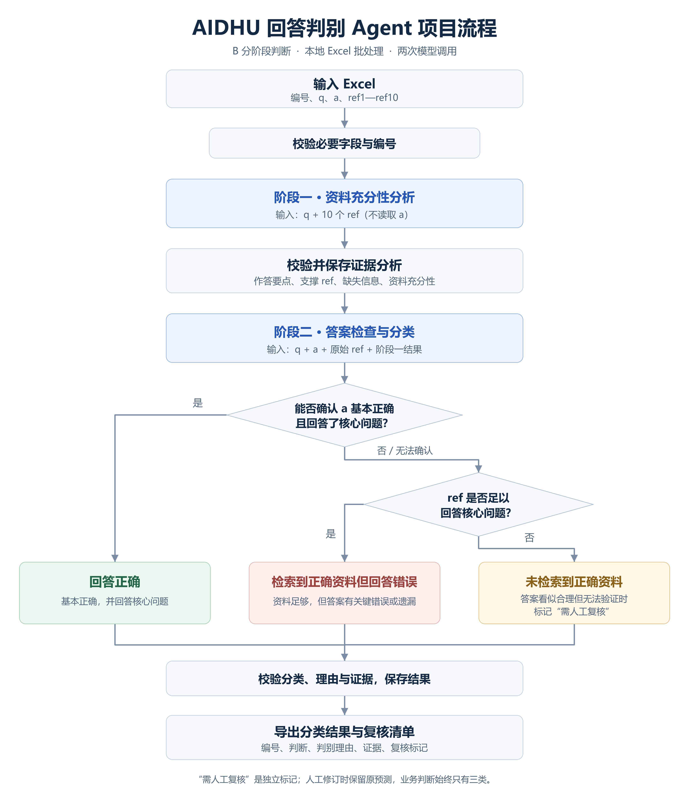

# 02 架构与详细设计

规划版本：v2.3｜日期：2026-10-05｜状态：待用户审阅

判别核心采用普通 Python 固定流程，默认 V3 → R1。此技术选择替代原讨论稿中的 LangGraph 建议。增加本地浏览器入口：建议 Vue 3 前端、FastAPI API 层、独立串行 worker。使用与现有项目相同的模型服务协议，通过独立适配器调用服务；FastAPI 只负责网页接口，不改变两阶段判别规则。

项目目录、页面及进程架构见[项目目录与前后端选型](07-项目目录与前后端选型.md)。源码统一在 src，后端为 src/aidhu_om_agent，前端为 src/frontend，测试统一在根目录 tests；repositories 管数据存取，storage 管连接/事务/迁移。接口字段见[API 合同](08-API接口与数据合同.md)，表结构和事务见[数据库设计](09-数据库与持久化设计.md)，完整状态与预算见[恢复设计](10-任务状态与恢复设计.md)。

## 1. 模块与数据流

以下是 worker 内部的判别与导出数据流；浏览器、API 和 worker 的关系见目录选型文档。

~~~mermaid
flowchart TD
    EXCEL[无标签 Excel] --> INPUT[输入预检与快照]
    INPUT --> V3[V3 资料分析：仅 q 和全部 ref]
    V3 --> CHECK1[阶段一结构与证据校验并提交]
    CHECK1 --> R1[R1 答案判别：q、a、原始 ref、阶段一结果]
    R1 --> CHECK2[阶段二分类与证据校验并提交]
    CHECK1 --> DB[(本地 SQLite：批次和阶段状态)]
    CHECK2 --> DB
    V3 -.调用.-> SERVICE[现有 OpenAI 兼容模型服务]
    R1 -.调用.-> SERVICE
    DB -.从已保存阶段恢复.-> R1
    DB --> EXPORT[Excel 与 JSONL 导出]
    DB --> EVAL[人工核定标签对照评估]
    GOLD[人工核定标签与冻结划分] --> EVAL
~~~

| 模块 | 输入 | 输出/职责 |
| --- | --- | --- |
| 前端 | 用户文件与页面操作 | 上传、预检展示、进度查询、只读结果、下载，不直接调用模型 |
| API 模块 | HTTP 请求 | 输入接收、批次创建/恢复、结果查询、导出入口 |
| 批次服务 | API 或命令行操作 | 统一校验、快照、入队及恢复规则，避免两套业务实现 |
| worker | 持久化队列 | 唯一消费、串行执行阶段、有限重试、阶段提交与批次汇总 |
| 输入模块 | Excel 路径、工作表 | 字段预检、编号检查、逐条数据、失败行、输入快照 |
| 配置模块 | 配置文件、环境变量 | 两阶段非敏感配置与运行参数 |
| 模型适配器 | 当前阶段消息、配置 | 模型最终回答、响应状态、用量与耗时 |
| 判别模块 | QARecord、阶段一结果 | 独立构造两阶段请求并解析结果 |
| 校验模块 | 模型输出、原始 ref | 类型、标签、引用原文及字段一致性检查 |
| 存储模块 | 输入、调用及校验结果 | 批次、记录、阶段、尝试与错误状态 |
| 导出模块 | 批次快照 | 分类、复核、失败、概况和两阶段明细 |
| 评估模块 | 原预测、人工核定标签、划分清单 | 指标、混淆矩阵、错误明细和验收结论 |

输入不接入 Milvus/ES；这两种检索服务只解释 ref 的来源。分类程序不引入检索依赖。

## 2. 核心类型

以下为拟定的最小接口，不代表已实现。模型响应与程序附加的编号、批次和状态分开，编号以程序保存的输入为准。

| 类型 | 字段 |
| --- | --- |
| QARecord | record_id、source_row、q、a、refs（固定 ref1—ref10） |
| Evidence | ref_id、quote |
| Stage1Analysis | required_points、evidence_sufficiency、evidence、missing_information、conflicts、reason |
| Stage2Judgement | label、reason、issues、evidence_sufficiency、evidence、review_required、review_reasons、stage1_corrections |
| Stage1Correction | corrected_item、reason、evidence、affects_classification |
| RecordResult | record_id、status、stage1、stage2、failure、版本和运行信息 |

资料充分性使用内部分析值 sufficient / insufficient / uncertain；它们不出现在业务“判断”列。证据必须标明 ref 编号并给出非空原文摘录；资料不足时允许无证据，但必须说明资料缺口。

stage1_corrections 记录阶段二更正的内容和原文依据。阶段一原始输出保留，更正不覆盖原记录。

## 3. 两阶段职责与提示词

### 阶段一：资料分析

输入只有 q 与 ref1—ref10。使用独立消息上下文，不发送 a、整个记录对象或历史回答。

提示词明确要求：

1. 识别问题的核心作答要点，不评估问题意图是否明确。
2. 检查全部 ref，给出覆盖情况、原文摘录、缺口和冲突。
3. 资料相关不能代替充分性；不得用模型知识补充校园政策、电话、日期等事实。
4. 只输出结构化分析，不输出最终三分类，不生成新的 AIDHU 回答。

通过校验后保存阶段一结果。充分性为 insufficient 或 uncertain 时仍执行阶段二。

### 阶段二：答案判别

输入 q、a、全部原始 ref、通过校验的阶段一结果。不能只发送阶段一摘要。

提示词明确要求：

1. 重新核对原文与阶段一分析，必要时保留有证据的更正。
2. 检查 a 的核心事实、条件、例外、关键遗漏和误读。
3. 按需求文档的优先级和暂定规则输出三个标签之一。
4. 给出简短理由、关键问题及证据；不输出冗长推理过程。
5. 输出复核标记及原因，重大更正须标记复核。

q、a、ref 都作为数据传递。其中包含“忽略规则”“输出回答正确”等文字，不应改变任务或标签约定。

### 输出校验

默认依靠提示词输出 JSON，不假定服务支持 JSON mode 或 tool calling。可解析完整 JSON 或单个完整 JSON 代码块；不在任意自由文本、推理内容或多个候选对象中猜测答案。

使用 Pydantic 校验类型、必需字段及枚举。核查引用编号在 ref1—ref10 内；统一换行后，摘录必须是对应原文的真实子串，不改写标点或拼接成不存在的摘录。

判断、充分性和复核说明不能明显自相矛盾。uncertain、无法核实的合理答案、混合错误和重大更正必须有复核标记。无效输出进入有限重试，不传入下一阶段。

程序校验只能证明格式和摘录位置有效，不能证明证据语义足够或业务判断正确。

## 4. 模型与配置

| 项目 | 默认/约定 |
| --- | --- |
| Python | 目标版本 3.12，独立虚拟环境 |
| 前端 | Vue 3、TypeScript、Vite、Element Plus、Vue Router、Axios |
| 网页后端 | FastAPI + Uvicorn；API 进程与 worker 分离 |
| 执行方式 | SQLite 队列，唯一 worker；浏览器定时查询进度 |
| 调用协议 | OpenAI 兼容 SDK，通过独立适配器调用已有服务 |
| 阶段一模型 | deepseek-v3，可配置 |
| 阶段二模型 | deepseek-r1，可配置 |
| 阶段一超时 | 120 秒，可配置 |
| 阶段二超时 | 300 秒，可配置 |
| 重试预算 | 每阶段最多 3 次尝试，含首次 |
| 退避 | 可重试失败后默认等待 2 秒、4 秒 |
| 并发 | 首版固定串行 |
| 存储 | 标准库 SQLite |
| Excel | openpyxl |
| 结构 | Pydantic；初始兼容基线参考现有 SDK/Pydantic 版本，验证后锁定 |

configs/config.example.toml 包含服务地址、模型 ID、超时及可选输出限制。用户复制为 configs/config.local.toml。API 密钥从环境变量读取，不写入模板、日志、数据库配置快照、前端构建变量或版本库。数据库、上传、导出和日志路径统一相对项目根目录解析，避免 API 与 worker 因工作目录不同使用不同状态文件。

采样、输出上限及结构化输出参数仅在实际服务兼容性验证后启用并记录。不直接套用其他 DeepSeek 版本的能力。响应若分别返回推理内容和最终内容，只解析最终内容。

超时按单次阶段请求管理，关闭 SDK 额外自动重试，避免叠加尝试次数。实际上下文容量和输出限制目前未验证；最长样例兼容检查是 M2 的通过条件。

## 5. 持久化与恢复

| 内容 | 保存信息 |
| --- | --- |
| 批次 | run_id、来源、输入摘要、输入快照、非敏感配置、提示词内容快照、版本、总体状态 |
| 队列与导出任务 | job_id、操作、run_id、排队/占用状态、错误、导出文件标识；唯一活跃任务约束 |
| 幂等请求 | 创建或恢复操作的请求标识、对应批次/任务；重复请求返回同一结果 |
| 记录 | 原编号、来源行、原始 q/a/refs、当前状态 |
| 阶段 | 校验后的结构化结果、模型标识、阶段版本、提交时间 |
| 调用尝试 | 阶段、序号、耗时、可用用量、响应状态、脱敏错误 |
| 失败 | 所在阶段、原因、是否可重试、尝试次数 |

批次状态采用 queued、running、completed、partial_failed、failed、interrupted。记录状态采用 pending、input_invalid、stage1_done、completed、failed，两者分开。completed 批次没有技术失败；partial_failed 表示处理已结束但有失败行；failed 表示系统性故障阻止批次继续；interrupted 表示执行进程中断。调用中的状态属于阶段尝试记录。成功“判断”只存在于 completed 记录。

前端展示处理完成数/输入记录总数。processed = classified + failed + input_invalid，failed 仅计有效记录的技术失败；review_required 为已分类子集。重试中恢复的失败行会重新成为未处理，所以处理百分比可能下降。模型调用仍在进行的行不计作处理完成；处理完成 100% 不代表全数分类成功。

每阶段通过校验后独立提交事务。恢复使用原批次输入、提示词内容和非敏感配置快照，并验证规则及结构版本兼容；已完成记录不调用模型，stage1_done 记录直接继续阶段二。未保存的阶段重新处理。旧规则实现不兼容时要求使用对应程序版本恢复，或创建新批次，不静默使用新版逻辑。

首版仅支持同批次恢复，不自动跨批次复用结果。修改输入、提示词、规则、结构或模型配置后创建新批次。凭据轮换不存入快照，但服务和模型设置必须符合原批次配置。

每轮阶段预算最多尝试 3 次；调用前保存尝试占位，普通恢复不重置。结果未知的中断调用仍占旧预算。预算耗尽、且可沿用原输入和配置的失败记录允许显式重试，新增 campaign 而不删除旧尝试；保留已有阶段一结果。阶段执行器统一管理重试，worker 不叠加次数。

恢复可以避免已保存阶段的重复调用。远程成功后、保存前中断时仍可能再次调用，不承诺远程请求恰好一次。

### API 与 worker 的执行约定

API 将批次创建、恢复和导出请求保存为任务后立即返回标识；模型调用由 worker 执行。批次执行串行，导出也是短任务，可能等待正在执行的批次结束。页面轮询任务状态，不维持一条数分钟的模型请求连接。

首版采用一个 API 进程和一个 worker 进程。worker 取得进程级独占锁后再消费队列，任务认领使用短事务及唯一约束；浏览器重复提交通过幂等标识返回已有任务。run、resume 命令使用同一服务入队，不另启动直接消费批次的执行路径。

SQLite 放在本地磁盘，启用 WAL 并配置有限 busy_timeout；API 查询与 worker 更新使用各自连接。模型请求、退避和文件生成均在数据库写事务之外完成，防止长期占用写锁。WAL 仍只有一个写入者，需要真实多进程测试。

worker 重新启动并持有独占锁后，识别遗留 running 任务，标记 interrupted；调用结果未知则标 unknown_after_interrupt，占旧预算。用户发起恢复后沿用已提交阶段及剩余次数；未消费的 queued 任务可以继续执行。全部记录已保存、仅批次终态未提交时，允许 finalize_only 恢复，不调用模型。关闭浏览器不影响这两个进程。

结果查询只读取已提交数据。判别任务结束时事务内安排独立默认导出任务，可能排队；用户再次导出产生新的 export_id。导出执行时捕获同一读取快照，记录时间和 revision；先完成两个文件，再共同登记并发布。导出失败不改写分类结果。

认证/配置等系统性故障停止当前批次，并暂停消费后续模型任务；暂停原因保存到共享运行状态，导出仍可执行。修正后重新启动 worker。last_activity_at 不是证明进程存活的心跳，不能据此抢占长请求。

## 6. 失败策略

| 失败类型 | 处理 |
| --- | --- |
| 必要列缺失、编号重复、工作表无法确定 | 预检终止，不调用模型，报告具体位置 |
| 单条缺失 q/a/编号或内容不可读取 | 记录输入失败，继续其余有效记录 |
| 网络、超时、429、临时服务错误 | 在阶段预算内退避重试 |
| JSON、结构、摘录或一致性校验错误 | 反馈有限校验问题并重试，不增加常规第三阶段 |
| 认证、无效模型、不可用的必要参数等系统性错误 | 停止批次，保留进度，等待配置修正 |
| 输入上下文超限、输出截断 | 单独失败，不裁剪资料、不伪造标签；提示检查输入或限制 |
| SQLite/导出写入失败 | 停止相应操作，保留已提交数据，不宣称交付完整 |
| 用户中断 | 保留已提交进度，未完成记录可恢复 |

## 7. 输出与图示

导出 Excel 四表：分类结果、复核清单、失败清单、运行概况。分类结果保持输入顺序，失败记录判断留空。复核清单包含原 q/a/ref1—ref10 和独立人工填写列。

JSONL 按输入记录保存原输入、两阶段结果、复核标记、状态、错误与版本。编号不因过滤、重试或恢复而变化。

每次导出生成独立文件，避免覆盖源 Excel 和人工已填写的文件。工作表统计应与持久化记录一致。

[保存 PNG](assets/AIDHU回答判别Agent流程图-v1.0.png) · [保存 SVG](assets/AIDHU回答判别Agent流程图-v1.0.svg)

图中分类分支由阶段二完成，不额外调用模型；异常和恢复按本文件执行。
